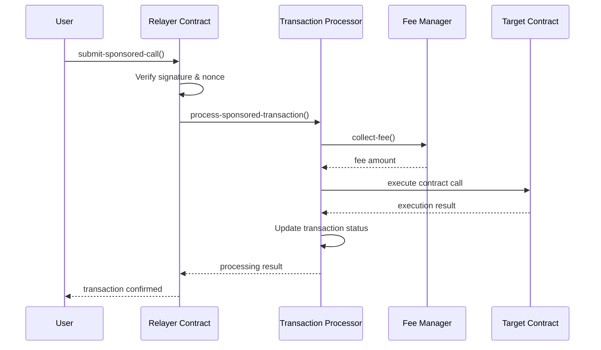

# Gas Sponsored Relayer - Phase 2

An enhanced Clarity smart contract system for sponsored transaction relaying on the Stacks blockchain with improved security, fee management, and comprehensive transaction processing capabilities.

## Overview

The Gas Sponsored Relayer allows sponsors to pay for users' transaction fees, enabling gasless transactions for end users. Phase 2 introduces a complete rewrite with a transaction processor architecture, enhanced security features, and a comprehensive fee management system.

## Key Features

### Core Functionality
- **Transaction Processing**: Centralized transaction processing with sponsored fee handling
- **Contract Whitelisting**: Only approved contracts can be called through the relayer
- **Batch Processing**: Process multiple transactions in a single batch for efficiency
- **Fee Integration**: Dynamic fee calculation and collection through the fee manager
- **Admin Controls**: Comprehensive administrative functions for system management

### Security Features
- **Access Control**: Only authorized relayers can process transactions
- **Transaction Deduplication**: Prevents replay attacks with transaction hash tracking
- **Contract Validation**: Validates contract addresses and function calls
- **Parameter Validation**: Comprehensive input validation for all operations
- **Status Tracking**: Complete transaction lifecycle tracking

### Analytics & Monitoring
- **Transaction Analytics**: Track success/failure rates and gas usage
- **Batch Analytics**: Monitor batch processing performance
- **Fee Analytics**: Track fee collection and distribution
- **Contract Usage**: Monitor which contracts are being used most

## Architecture

The system consists of three main contracts:

### 1. Transaction Processor Contract (`transaction-processor.clar`)

The core contract that handles all sponsored transaction processing.

#### Key Functions

**Admin Functions:**
- `set-relayer-contract`: Configure the authorized relayer contract
- `set-fee-manager-contract`: Configure the fee manager contract
- `add-supported-contract`: Add a contract to the whitelist
- `toggle-contract-support`: Enable/disable contract support

**Processing Functions:**
- `process-sponsored-transaction`: Process a single sponsored transaction
- `process-batch-transactions`: Process multiple transactions in a batch

**Query Functions:**
- `get-transaction-status`: Get detailed transaction information
- `get-batch-info`: Get batch processing information
- `get-supported-contract`: Check contract support status
- `get-processing-stats`: Get overall system statistics

### 2. Fee Manager Contract (`fee-manager.clar`)

Manages dynamic fee structures and fee collection.

#### Key Functions

**Configuration:**
- `set-contract-fee`: Configure fees for specific contracts
- `toggle-contract-fee`: Enable/disable fees for contracts
- `collect-fee`: Process fee collection for transactions

**Analytics:**
- `get-contract-fee`: Get fee configuration
- `get-total-fees-collected`: Get total fees collected
- `get-contract-stats`: Get detailed analytics for contracts

### 3. Relayer Contract (`relayer.clar`)

Handles user interaction, signature verification, and transaction submission.

#### Key Functions

**User Functions:**
- `submit-sponsored-call`: Submit a transaction for sponsored processing
- `get-user-nonce`: Get current nonce for replay protection
- `get-sponsored-info`: Get transaction details

**Sponsor Functions:**
- `deposit-sponsor-balance`: Deposit funds for sponsoring
- `withdraw-sponsor-balance`: Withdraw unused funds
- `get-sponsor-balance`: Check available balance

## Contract Integration Flow



## Usage Examples

### 1. Admin Setup

```clarity
;; Set up the relayer contract
(contract-call? .transaction-processor set-relayer-contract .relayer)

;; Set up the fee manager
(contract-call? .transaction-processor set-fee-manager-contract .fee-manager)

;; Add a supported contract
(contract-call? .transaction-processor add-supported-contract
  'ST1PQHQKV0RJXZFY1DGX8MNSNYVE3VGZJSRTPGZGM.my-dapp
  "My DApp Contract"
  (list "transfer" "mint" "burn"))
```

### 2. Fee Configuration

```clarity
;; Configure fees for a contract
(contract-call? .fee-manager set-contract-fee
  "My DApp Contract"
  u100000      ;; base fee (0.1 STX)
  u250         ;; percentage fee (2.5%)
  u1000000)    ;; max fee (1 STX)

;; Enable fee collection
(contract-call? .fee-manager toggle-contract-fee
  "My DApp Contract"
  true)
```

### 3. Processing Transactions

```clarity
;; Process a single transaction
(contract-call? .transaction-processor process-sponsored-transaction
  0x1234567890abcdef...  ;; transaction hash
  'ST1PQHQKV0RJXZFY1DGX8MNSNYVE3VGZJSRTPGZGM  ;; user
  'ST1PQHQKV0RJXZFY1DGX8MNSNYVE3VGZJSRTPGZGM.my-dapp  ;; contract
  "transfer"  ;; function
  u1000000    ;; amount
  (list))     ;; parameters

;; Process multiple transactions
(contract-call? .transaction-processor process-batch-transactions
  (list
    {
      tx-hash: 0x1234...,
      user: 'ST1...,
      contract-address: 'ST1....my-dapp,
      function-name: "transfer",
      amount: u1000000,
      parameters: (list)
    }
    ;; ... more transactions
  ))
```

### 4. Monitoring and Analytics

```clarity
;; Check transaction status
(contract-call? .transaction-processor get-transaction-status 0x1234...)

;; Get batch information
(contract-call? .transaction-processor get-batch-info u1)

;; Get processing statistics
(contract-call? .transaction-processor get-processing-stats)

;; Get contract analytics
(contract-call? .fee-manager get-contract-stats "My DApp Contract")
```

## Error Codes

### Transaction Processor
- `u300`: Unauthorized access
- `u301`: Invalid signature
- `u302`: Expired transaction
- `u303`: Insufficient balance
- `u304`: Transaction execution failed
- `u305`: Invalid contract
- `u306`: Transaction already processed
- `u307`: Invalid parameters
- `u308`: Fee calculation failed

### Fee Manager
- `u200`: Unauthorized access
- `u201`: Invalid fee configuration
- `u202`: Contract not found
- `u203`: Invalid percentage (exceeds maximum)

### Relayer
- `u100`: Invalid nonce or expired transaction
- `u101`: Signature verification failed
- `u102`: Transaction not found
- `u103`: Unauthorized access
- `u104`: Transaction already paid
- `u105`: Insufficient sponsor balance
- `u106`: Invalid amount
- `u107`: Sponsor not found

## Development

### Prerequisites
- Clarinet >= 1.7.0
- Stacks CLI
- Node.js >= 16.0.0

### Setup
```bash
# Clone the repository
git clone <repository-url>
cd gas-sponsored-relayer

# Install Clarinet (if not already installed)
curl --proto '=https' --tlsv1.2 -sSf https://run.clarinet.sh | sh

# Check contracts
clarinet check

# Run tests
clarinet test

# Start local development environment
clarinet integrate
```

### Testing

```bash
# Run all tests
clarinet test

# Run specific test file
clarinet test tests/transaction-processor-test.ts

# Run tests with coverage
clarinet test --coverage

# Interactive testing
clarinet console
```

### Contract Verification

```bash
# Check contract syntax
clarinet check

# Analyze contracts for potential issues
clarinet analyze

# Generate cost analysis
clarinet costs
```

## Deployment

### Testnet Deployment

```bash
# Deploy to testnet
clarinet deploy --testnet

# Verify deployment
clarinet run --testnet "get-contract-info"
```

### Mainnet Deployment

```bash
# Deploy to mainnet (ensure thorough testing first)
clarinet deploy --mainnet
```

## Security Considerations

### Access Control
- Only contract owner can modify supported contracts
- Only authorized relayers can process transactions
- Fee manager access is restricted to authorized contracts

### Transaction Security
- All transactions are tracked to prevent replays
- Contract whitelisting prevents unauthorized contract calls
- Parameter validation prevents malicious inputs

### Economic Security
- Fee collection prevents spam attacks
- Sponsor balance management prevents overspending
- Batch processing limits prevent resource exhaustion

## Performance Characteristics

### Transaction Processing
- **Single Transaction**: ~1000 gas units
- **Batch Processing**: Scales linearly with batch size
- **Maximum Batch Size**: 50 transactions

### Storage Efficiency
- **Transaction Records**: ~200 bytes per transaction
- **Batch Records**: ~150 bytes per batch
- **Contract Records**: ~300 bytes per supported contract

## Monitoring and Analytics

### Key Metrics
- Total transactions processed
- Success/failure rates
- Average gas usage
- Fee collection totals
- Popular contracts and functions

### Available Data
- Transaction-level details (status, fees, gas usage)
- Batch-level summaries (success rates, total fees)
- Contract-level analytics (usage patterns, revenue)
- System-level statistics (throughput, performance)

## Roadmap

### Phase 3 (Planned)
- [ ] Cross-chain transaction support
- [ ] Advanced batch optimization
- [ ] Machine learning-based fee optimization
- [ ] Governance token integration
- [ ] Multi-signature sponsor approval

### Future Enhancements
- [ ] Mobile SDK integration
- [ ] Web3 wallet integration
- [ ] Advanced analytics dashboard
- [ ] Automated compliance reporting
- [ ] Enterprise management tools

## Contributing

We welcome contributions! Please see our [Contributing Guide](CONTRIBUTING.md) for details.

### Development Process
1. Fork the repository
2. Create a feature branch (`git checkout -b feature/amazing-feature`)
3. Make your changes
4. Add comprehensive tests
5. Run the test suite (`clarinet test`)
6. Commit your changes (`git commit -m 'Add amazing feature'`)
7. Push to the branch (`git push origin feature/amazing-feature`)
8. Open a Pull Request

### Code Standards
- Follow Clarity best practices
- Include comprehensive tests for all new features
- Update documentation for any API changes
- Use descriptive commit messages

## License

This project is licensed under the MIT License - see the [LICENSE](LICENSE) file for details.

## Support

### Getting Help
- 📖 [Documentation Wiki](https://github.com/your-org/gas-sponsored-relayer/wiki)
- 💬 [Discord Community](https://discord.gg/your-discord)
- 🐛 [Issue Tracker](https://github.com/your-org/gas-sponsored-relayer/issues)
- 📧 Email: hamsohood@gmail.com

### Reporting Issues
Please use the GitHub issue tracker to report bugs or request features. Include:
- Clear description of the issue
- Steps to reproduce
- Expected vs actual behavior
- Clarinet version and system information

---

**Note**: This is a Phase 2 release with significant architectural changes. Please review the migration guide if upgrading from Phase 1.
